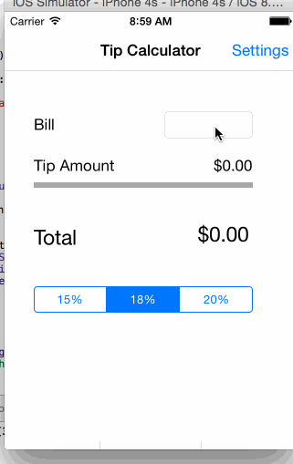

# TipCalculator

A basic tip calculator to allow user choose different percentage of tips.

Time spent: 3 hours spent in total

Completed user stories:

 * [x] Required: User can input bill amount and choose a percentage to see the tip amount and total amount

Walkthrough of all user stories:

